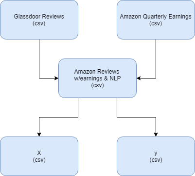

# Internal Sentiment towards Workplace

At a company with stock, internal members usually are given a portion of stock in their contract. The models in this repository will predict the average member's  view of the company through 2 predictors, work/life balance and CEO approval. This model will use quarterly earnings, stock price, sentiment analysis, and other features to try and predict.

## Getting Started
These instructions will get you a copy of the project up and running on your local machine for development and testing purposes.

### Prerequisites
- Python 3
- pip
- virtualenv

### Local Installation
Fork the code from my repository and go to a location where you want to save the code, then clone the code to your computer:

```
git clone https://github.com/<your-username>/Internal_Sentiment_Towards_Workplace.git
```
Go into the project directory:
```
cd Internal_Sentiment_Towards_Workplace
```
Create a Python virtual environment in which to install the dependencies:
```
virtualenv venv
```
Activate the environment (on Windows):
```
venv\Scripts\activate
```
Install the dependencies from the requirements.txt file:
```
pip install -r dev_requirements.txt
```
If system directory permissions are denied, then run the following to install into a your home directory instead:
```
pip install -r dev_requirements.txt --user
```
The python packages required for development are listed in dev_requirements.txt. The python packages needed for deployment are listed in requirements.txt .
## Running the unit tests
Since the pytest package can discover and run all unit tests, we just write this into the command line:
```
py.test
```
The unit tests are written in such a way that they will find the python packages that are being tested. However, if you find that a package not found error comes up, this might help:
```
set PYTHONPATH=%PYTHONPATH%; .\
```
#### Architecture
Preprocessing



WebApp Architecture


#### Deliverables

* A dashboard for C-suite Team Leaders to use which informs them about how their team members feeling about the workplace. This will pull in new data quarterly, and update a useful display for the Team Leader. How you use these predictions is up to you.

#### Notes
